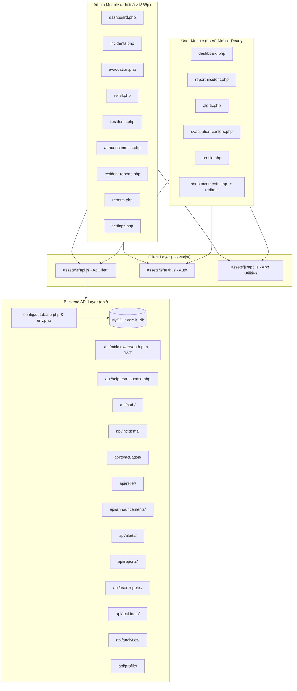
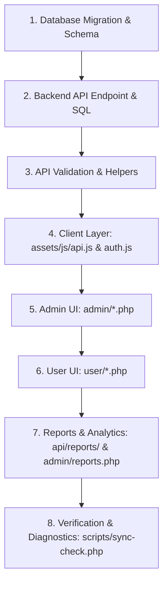

# ODMIS System Memory & Cross-File Synchronization Matrix
**Online Disaster Management Information System (ODMIS)**  
*Authoritative Architecture, Dependency Graph, and Synchronization Rules*

---

## 1. System Topology & Architecture Overview

ODMIS is a full-stack, decoupled PHP + MySQL web application. The frontend communicates with a JSON REST API over HTTP using JWT Bearer authentication.



---

## 2. Master Entity & Cross-File Dependency Matrix

### 2.1 Entity: `users` (Residents & Administrators)

| Attribute | DB Column (`users`) | API JSON Key | Admin UI Reference | User UI Reference | Notes / Rules |
| :--- | :--- | :--- | :--- | :--- | :--- |
| **ID** | `id` (INT PK) | `id` / `sub` | `row.id` in `residents.php` | `session.id` | JWT payload subject (`sub`) |
| **Username** | `username` (VARCHAR 50) | `username` | `row.username` | `session.username` | Unique, lowercase trimmed |
| **Email** | `email` (VARCHAR 100) | `email` | `row.email` | `session.email`, profile form | Unique, validated via FILTER_VALIDATE_EMAIL |
| **Password** | `password_hash` (VARCHAR 255)| *(never exposed)* | Reset modal | Profile / Change Password | `password_hash($p, PASSWORD_DEFAULT)` |
| **Role** | `role` (ENUM: `admin`,`user`)| `role` | Filter / Table badges | `session.role` | Determines routing & API access |
| **Full Name**| `full_name` (VARCHAR 100)| `full_name` | `row.full_name` | Topbar, sidebar, welcome banner | Display name throughout UI |
| **Contact** | `contact_number` (VARCHAR 20)| `contact_number` | `row.contact_number` | Profile form | Validated `^09\d{9}$` (PH mobile format) |
| **Birthdate**| `date_of_birth` (DATE)| `date_of_birth` | Details modal | Profile edit modal | Format `YYYY-MM-DD` |
| **Address** | `address` (TEXT) | `address` | `row.address` | Profile edit modal | Barangay/Zone text |
| **Status** | `status` (`active`,`inactive`)| `status` | Toggle switch in `residents.php`| Guard in `login.php` | **Note:** Lowercase ENUM (`active`/`inactive`) |
| **Security Q**| `security_question` | `security_question`| — | Forgot password step 1 | Plain text question |
| **Security A**| `security_answer_hash` | *(never exposed)* | — | Forgot password step 2 | `password_hash(strtolower($ans))` |

> **Connected Files for `users`:**
> - DB: `database/migrations/001_create_tables.sql`
> - API: `api/auth/login.php`, `register.php`, `me.php`, `forgot-password.php`, `api/residents/index.php`, `show.php`, `update.php`, `toggle-status.php`, `api/profile/index.php`, `update.php`, `change-password.php`
> - JS: `assets/js/auth.js` (`getSession()`, `requireAuth()`, `requireAdmin()`, `requireUser()`), `assets/js/api.js`
> - UI: `login.php`, `register.php`, `forgot-password.php`, `admin/residents.php`, `admin/settings.php`, `user/profile.php`

---

### 2.2 Entity: `incidents` (Disaster Incidents)

| Attribute | DB Column (`incidents`) | API JSON Key | Admin UI (`admin/incidents.php`) | User Alerts (`user/alerts.php`) | Reports & Analytics |
| :--- | :--- | :--- | :--- | :--- | :--- |
| **ID** | `id` (INT PK) | `id` | Table row key, edit target | Joined in merged alerts feed | Primary key |
| **Code** | `incident_code` (VARCHAR 20) | `incident_code` | `INC-XXXX` badge | Displayed as incident identifier | Unique index |
| **Type** | `disaster_type` (ENUM) | `disaster_type` | Type badge / filter | Icon mapping & type filter | ENUM: `'Flood'`, `'Typhoon'`, `'Earthquake'`, `'Fire'`, `'Landslide'` |
| **Title** | `title` (VARCHAR 200) | `title` | Table title, modal heading | Alert title | Required string |
| **Description**| `description` (TEXT) | `description` | Table tooltip, modal text | Alert card description | Text |
| **Location** | `location` (VARCHAR 200) | `location` | Zone / Street field | Included in `affected_areas` | Required string |
| **Barangay** | `barangay` (VARCHAR 100) | `barangay` | Filter & dropdown select | Filter & display | Dropdown restricted list |
| **Municipality**| `municipality` (VARCHAR 100)| `municipality` | Readonly "Santo Niño (Faire)" | Displayed in details | Default: `Santo Niño (Faire)` |
| **Date** | `incident_date` (DATE) | `incident_date` | Date picker, table column | Source of `issued_at` timestamp | Format `YYYY-MM-DD` |
| **Time** | `incident_time` (TIME) | `incident_time` | Time input (optional) | Combined into `issued_at` | **MUST BE `NULL` if blank**, not `""`! |
| **Severity** | `severity` (ENUM) | `severity` | Badge (`Low`,`Moderate`,`High`,`Critical`) | Theme border & color chip | ENUM: `'Low'`, `'Moderate'`, `'High'`, `'Critical'` |
| **Status** | `status` (ENUM) | `status` | `'Active'` / `'Resolved'` button | Filter condition (`status != 'Resolved'`) | ENUM: `'Active'`, `'Resolved'` |
| **Reporter** | `reported_by` (VARCHAR 150) | `reported_by` | Table / modal author | `issued_by_name` in merged feed | Officer name |

> **Connected Files for `incidents`:**
> - DB: `database/migrations/001_create_tables.sql`
> - API: `api/incidents/index.php`, `show.php`, `store.php`, `update.php`, `destroy.php`, `api/alerts/index.php` (merged union query), `api/analytics/*`, `api/reports/incidents.php`, `export-csv.php`, `export-pdf.php`
> - UI: `admin/incidents.php`, `admin/dashboard.php` (recent incidents table + 4 charts), `admin/reports.php`, `user/alerts.php`, `user/dashboard.php`

---

### 2.3 Entity: `evacuation_centers` (Evacuation Centers)

| Attribute | DB Column (`evacuation_centers`) | API JSON Key | Admin UI (`admin/evacuation.php`) | User UI (`user/evacuation-centers.php`) |
| :--- | :--- | :--- | :--- | :--- |
| **ID** | `id` (INT PK) | `id` | Row key, edit ID | Modal view target (`viewCenter(id)`) |
| **Code** | `center_code` (VARCHAR 20) | `center_code` | Code chip (`EVAC-XXX`) | Details modal |
| **Name** | `center_name` (VARCHAR 200) | `center_name` | Name column, edit input | Card header title |
| **Location** | `location` (VARCHAR 300) | `location` | Location text | Location paragraph with pin icon |
| **Barangay** | `barangay` (VARCHAR 100) | `barangay` | Barangay filter & select | Card subheader & filter |
| **Capacity** | `capacity` (INT UNSIGNED) | `capacity` | Total capacity number | Capacity badge & occupancy bar |
| **Occupied** | `occupied_slots` (INT UNSIGNED) | `occupied_slots` | Occupied number | Occupancy progress bar percentage |
| **Available**| *(computed SQL)* | `available_slots` | `(capacity - occupied_slots)` | `sumAvailable` stat & badge |
| **Contact** | `contact_person` (VARCHAR 100)| `contact_person` | Contact name | Contact person text |
| **Phone** | `contact_number` (VARCHAR 20) | `contact_number` | Contact phone | Contact phone link/text |
| **Status** | `status` (ENUM) | `status` | `'Open'` / `'Closed'` | Status badge (Open = green, Closed = gray) |

> **Connected Files for `evacuation_centers`:**
> - DB: `database/migrations/001_create_tables.sql`
> - API: `api/evacuation/index.php`, `show.php`, `store.php`, `update.php`, `destroy.php`, `api/reports/evacuation.php`, `api/reports/export-csv.php`, `api/reports/export-pdf.php`
> - UI: `admin/evacuation.php`, `admin/reports.php`, `user/evacuation-centers.php`, `user/dashboard.php` (`statEvacCenters`)

---

### 2.4 Entity: `relief_operations` (Relief Aid Tracking)

| Attribute | DB Column (`relief_operations`) | API JSON Key | Admin UI (`admin/relief.php`) | Reports Module (`admin/reports.php`) |
| :--- | :--- | :--- | :--- | :--- |
| **ID** | `id` (INT PK) | `id` | Edit / delete action ID | Row identifier |
| **Batch No** | `batch_number` (VARCHAR 20) | `batch_number` | Code chip (`REL-XXX`) | `row.batch_number` column |
| **Date** | `operation_date` (DATE) | `operation_date` | Date picker & display | `formatDateDisplay(row.operation_date)` |
| **Barangay** | `barangay` (VARCHAR 100) | `barangay` | Dropdown & filter | Filter & table column |
| **Type** | `relief_type` (VARCHAR 100) | `relief_type` | Food packs, medical kits, etc. | Table column |
| **Quantity** | `quantity` (INT UNSIGNED) | `quantity` | Quantity number input | Quantity column |
| **Unit** | `unit` (VARCHAR 50) | `unit` | Boxes, bags, kits, etc. | Unit column |
| **Status** | `status` (ENUM) | `status` | `'Pending'`, `'In Progress'`, `'Completed'` | Status badge & filter |
| **Distributor**| `distributed_by` (VARCHAR 150)| `distributed_by` | Agency / Personnel name | Table / export column |
| **Notes** | `notes` (TEXT) | `notes` | Remarks / distribution notes | Export remarks |

> **Connected Files for `relief_operations`:**
> - DB: `database/migrations/001_create_tables.sql`
> - API: `api/relief/index.php`, `show.php`, `store.php`, `update.php`, `api/reports/relief.php`, `api/reports/export-csv.php`, `api/reports/export-pdf.php`
> - UI: `admin/relief.php`, `admin/reports.php`

---

### 2.5 Entity: `announcements` (DRRM Public Advisories)

| Attribute | DB Column (`announcements`) | API JSON Key | Admin UI (`admin/announcements.php`) | User UI (`user/dashboard.php`) |
| :--- | :--- | :--- | :--- | :--- |
| **ID** | `id` (INT PK) | `id` | Row key, edit ID | Modal / Card identifier |
| **Title** | `title` (VARCHAR 300) | `title` | Advisory headline | Card title |
| **Body** | `body` (LONGTEXT) | `body` | Content textarea (`fieldBody`) | Content paragraph |
| **Category** | `category` (VARCHAR 100) | `category` | Advisory, Weather, General | Category badge |
| **Published By**| `published_by` (INT FK) | `published_by_name`| JOIN `users.full_name` | Author line |
| **Published At**| `published_at` (DATE) | `published_at` | Date input | Formatted publication date |
| **Is Active** | `is_active` (TINYINT 1) | `is_active` | Toggle Active / Inactive switch | Public feed filter (`is_active = 1`) |

> **Connected Files for `announcements`:**
> - DB: `database/migrations/001_create_tables.sql`
> - API: `api/announcements/index.php`, `store.php`, `update.php`, `destroy.php`
> - UI: `admin/announcements.php`, `user/dashboard.php`, `user/announcements.php` (redirects to dashboard)

---

### 2.6 Entity: `disaster_alerts` (Official Emergency Broadcasts)

| Attribute | DB Column (`disaster_alerts`) | API JSON Key | Admin Alerts (`admin/dashboard.php`) | User Alerts (`user/alerts.php`) |
| :--- | :--- | :--- | :--- | :--- |
| **ID** | `id` (INT PK) | `id` | Reference ID | Card ID |
| **Type** | `alert_type` (ENUM) | `alert_type` | Typhoon, Flood, Earthquake, Fire, Landslide | Icon & type filter |
| **Title** | `title` (VARCHAR 200) | `title` | Alert title | Alert headline |
| **Description**| `description` (TEXT) | `description` | Text | Alert summary |
| **Affected** | `affected_areas` (TEXT) | `affected_areas` | Affected barangays list | Map marker label |
| **Severity** | `severity` (ENUM) | `severity` | `'Low'`,`'Moderate'`,`'High'`,`'Critical'` | Card border color & badge |
| **Status** | `status` (ENUM) | `status` | `'Active'`, `'Resolved'` | Filter: only Active shown to users by default |
| **Issued At**| `issued_at` (DATETIME) | `issued_at` | Timestamp | Displayed timestamp |
| **Expires At**| `expires_at` (DATETIME) | `expires_at` | Expiration date/time | Auto-expiry indicator |

> **Connected Files for `disaster_alerts`:**
> - DB: `database/migrations/001_create_tables.sql`
> - API: `api/alerts/index.php`, `store.php`, `update.php`, `deactivate.php`, `destroy.php`
> - UI: `admin/dashboard.php`, `user/alerts.php`, `user/dashboard.php`

---

### 2.7 Entity: `user_reports` (Resident Citizen Incident Reports)

| Attribute | DB Column (`user_reports`) | API JSON Key | User Submission (`user/report-incident.php`) | Admin Review (`admin/resident-reports.php`) |
| :--- | :--- | :--- | :--- | :--- |
| **ID** | `id` (INT PK) | `id` | Submitted report ID | Row ID & view modal trigger |
| **User ID** | `user_id` (INT FK) | `user_id` | Auto-populated from JWT token (`sub`) | Resident profile lookup |
| **Type** | `incident_type` (ENUM) | `incident_type` | Dropdown: Flood, Typhoon, Earthquake, Fire, Landslide, **Other** | Badge & category filter |
| **Title** | `title` (VARCHAR 255) | `title` | Report title input | Report title in table & modal |
| **Description**| `description` (TEXT) | `description` | Incident details textarea | Detailed explanation in modal |
| **Location** | `location` (VARCHAR 300) | `location` | Specific location / landmark | Location text |
| **Barangay** | `barangay` (VARCHAR 100) | `barangay` | Selected barangay | Barangay filter & column |
| **Municipality**| `municipality` (VARCHAR 100)| `municipality` | Default: `Sto. Niño, Cagayan` | Municipality column |
| **Report Date**| `report_date` (DATE) | `report_date` | Date input (`incident_date` form field)| Date column |
| **Time** | `incident_time` (TIME) | `incident_time` | Time input | Incident time display |
| **Photo** | `photo_path` (VARCHAR 300) | `photo_path` | File input (`multipart/form-data`) | Image thumbnail & preview modal |
| **Status** | `status` (ENUM) | `status` | Default: `'Pending'` | Dropdown: `'Pending'`, `'Reviewed'`, `'Resolved'` |
| **Reviewed By**| `reviewed_by` (INT FK) | `reviewed_by` | — | Admin user ID who reviewed |

> **Connected Files for `user_reports`:**
> - DB: `database/migrations/001_create_tables.sql`, `002_add_user_reports_incident_fields.sql`
> - API: `api/user-reports/index.php`, `show.php`, `store.php`, `update.php`, `update-status.php`, `api/uploads/serve.php`
> - UI: `user/report-incident.php`, `user/dashboard.php` (`statMyReports`), `admin/resident-reports.php`

---

## 3. Strict Change-Propagation Protocol

Whenever any part of the system is created, updated, renamed, or deleted, you **MUST** follow this exact 8-step synchronization sequence:



### Step 1: Database Migration & Schema
- Create or update the SQL migration in `database/migrations/`.
- Ensure column types, nullability, default values, and foreign keys are explicitly specified.
- For `ENUM` columns, verify all intended choices and note their exact casing.
- Run the migration against the active MySQL database `odmis_db`.

### Step 2: Backend API Endpoints & SQL Queries
- Update all SQL statements in the corresponding `api/<domain>/` endpoints:
  - `index.php`: Check `SELECT` column list or `*`, check `WHERE` filters and sorting.
  - `show.php`: Verify single record fetch and joined author/user fields.
  - `store.php`: Update `INSERT INTO` columns, placeholders, and parameter bindings.
  - `update.php`: Update `UPDATE` dynamic fields, parameter arrays, and ID parsing.
  - `destroy.php`: Verify cascade or foreign key constraints before deletion.

### Step 3: API Input Validation & Sanitization
- Check required field checks: `array_filter($required, ...)` in `store.php` and `update.php`.
- Sanitize user inputs using `sanitize()` from `api/helpers/response.php`.
- Handle nullable dates and times cleanly: convert empty strings `""` to `null` before database execution.
- Maintain consistent JSON response envelope:
  ```json
  {"success": true, "message": "...", "data": ...}
  {"success": false, "message": "...", "errors": ...}
  ```

### Step 4: Client Layer (`assets/js/api.js` & `assets/js/auth.js`)
- If the endpoint route or HTTP method changed, verify `ApiClient.get()`, `post()`, `put()`, `patch()`, or `del()`.
- If an entity involves file uploads (e.g. photos), ensure `ApiClient.upload(path, formData)` is utilized.
- If session or user profile attributes changed, update `Auth.getSession()` in `assets/js/auth.js`.

### Step 5: Admin UI (`admin/*.php`)
- Update table headers (`<thead>`) and row rendering (`buildRow` / template literals).
- Update modal forms: inputs, selects, hidden ID fields, and validation feedback.
- Update form reset handlers (`resetForm`) and save payloads (`saveItem`).
- Update filter event listeners: search input, category/barangay/status dropdowns.
- Update summary badges and record counters (`recordCount`).

### Step 6: User UI (`user/*.php`)
- Ensure mobile responsiveness is intact (no rigid pixel widths, use Bootstrap grid).
- Update cards, feeds, badges, and detail modals to match backend JSON keys.
- Update notification badges and counter statistics.

### Step 7: Reports & Analytics Module
- If incident or evacuation fields changed, update:
  - `api/analytics/summary.php`, `by-barangay.php`, `by-type.php`, `monthly.php`.
  - `api/reports/incidents.php`, `residents.php`, `relief.php`, `evacuation.php`.
  - `api/reports/export-csv.php`: Header array and row mapping.
  - `api/reports/export-pdf.php`: Column headers, cell widths, and data rows.
  - `admin/reports.php`: `TABLE_HEADERS` and `buildRow()`.

### Step 8: Verification & Runbook
- Run the automated sync checker:
  ```powershell
  php scripts/sync-check.php
  ```
- Verify all tests pass with zero errors before considering the task complete.

---

## 4. Critical Architecture & Security Invariants

1. **Apache Authorization Header Forwarding**:
   - In XAMPP for Windows, Apache does not pass the `Authorization` header to PHP by default.
   - `api/.htaccess` MUST always contain:
     ```apache
     RewriteRule .* - [E=HTTP_AUTHORIZATION:%{HTTP:Authorization}]
     ```
2. **Password Security**:
   - Never store plain text passwords.
   - Always hash with `password_hash($pass, PASSWORD_DEFAULT)`.
   - Always verify with `password_verify($pass, $hash)`.
   - Security question answers must be normalized (lowercased, trimmed) and hashed with `password_hash()`.
3. **Prepared Statements**:
   - Every SQL query containing external input must use `PDO::prepare()` and parameter binding.
   - No string concatenation into SQL statements.
4. **Desktop vs Mobile Guard**:
   - All `admin/*.php` pages include `#mobileGuard` requiring minimum desktop width (1366px).
   - All `user/*.php` pages are fully responsive on mobile, tablet, and desktop.
5. **Date & Time Nullability**:
   - When receiving optional time/date inputs from forms, empty strings `""` must be converted to `NULL` to avoid MySQL zero-date or invalid timestamp errors.

---

## 5. Quick Reference: File Locations

- **Database Migrations:** `database/migrations/`
- **Database Connection:** `config/database.php`
- **Environment & JWT Secret:** `config/env.php`
- **API Helpers & Middleware:** `api/helpers/response.php`, `api/middleware/auth.php`
- **Client Scripts:** `assets/js/api.js`, `assets/js/auth.js`, `assets/js/app.js`
- **Global Styles:** `assets/css/style.css`
- **Admin Pages:** `admin/`
- **User Pages:** `user/`
- **Sync Checker:** `scripts/sync-check.php`
