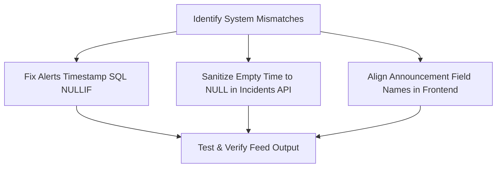

# ODMIS System Check & Diagnostic Report

This report documents the detailed breakdown of the system health, active database records, and identified code issues in the Online Disaster Management Information System (ODMIS) local environment.

---

## 1. Environment & Database Status

| Component | Status | Details |
| :--- | :--- | :--- |
| **Apache Server** | ✅ **Running** | Accessible at `http://localhost/ODMIS-Online-Disaster-Management-Information-System/` |
| **MySQL / MariaDB** | ✅ **Running** | Connected via XAMPP MySQL binary |
| **Database Connection** | ✅ **Success** | Database `odmis_db` is connected successfully using `root` |

---

## 2. Table Record Counts

The database contains the following active records:

| Table | Status | Records Count |
| :--- | :--- | :--- |
| [`users`](../database/migrations/001_create_tables.sql) | ✅ OK | **3** registered users |
| [`incidents`](../database/migrations/001_create_tables.sql) | ✅ OK | **5** logged disaster incidents |
| [`disaster_alerts`](../database/migrations/001_create_tables.sql) | ✅ OK | **7** issued alerts |
| [`announcements`](../database/migrations/001_create_tables.sql) | ✅ OK | **6** active announcements |
| [`evacuation_centers`](../database/migrations/001_create_tables.sql) | ✅ OK | **0** evacuation centers |
| [`relief_operations`](../database/migrations/001_create_tables.sql) | ✅ OK | **8** relief operations |
| [`user_reports`](../database/migrations/001_create_tables.sql) | ✅ OK | **4** user-submitted reports |

---

## 3. Critical Integration Issues Found

We detected several field mismatches and data-handling bugs that explain the issues you mentioned:

### Bug A — Newly Added Incidents Hidden (NULL timestamp)
> [!IMPORTANT]
> **Files affected:**
> - [`api/alerts/index.php`](../api/alerts/index.php)
> - [`api/incidents/store.php`](../api/incidents/store.php)
> - [`api/incidents/update.php`](../api/incidents/update.php)
>
> **Symptom:** When adding an incident on the admin page and leaving the optional "Time" field blank, it is sent as an empty string `""`. Inside `api/alerts/index.php`, the query uses `COALESCE(i.incident_time, '00:00:00')` to format the timestamp. Since `""` is not `NULL`, `COALESCE` returns `""`, causing MySQL `TIMESTAMP()` to return `NULL`. This places the new incident at the very bottom of the feed (sorted descending), making it seem like it was never added.
>
> **Solution:** Use `NULLIF(i.incident_time, '')` inside the COALESCE in `api/alerts/index.php` and cleanly set empty string inputs to `NULL` on write in `store.php` and `update.php`.

### Bug B — Blank Announcements and Mismatching Fields
> [!WARNING]
> **Files affected:**
> - [`user/announcements.php`](../user/announcements.php)
> - [`user/dashboard.php`](../user/dashboard.php)
>
> **Symptom:** The announcements list cards are showing up blank with missing dates and author names.
>
> **Reason:** The REST API endpoint `/api/announcements/index.php` returns database column names:
> - `body`
> - `published_at`
> - `published_by_name`
>
> But the frontend Javascript files expect the old prototype mock properties:
> - `content`
> - `date_posted` / `created_at`
> - `posted_by`
>
> **Solution:** Update the Javascript templates in `user/announcements.php` and `user/dashboard.php` to match the backend REST API response fields.

---

## 4. Proposed Fix Plan

